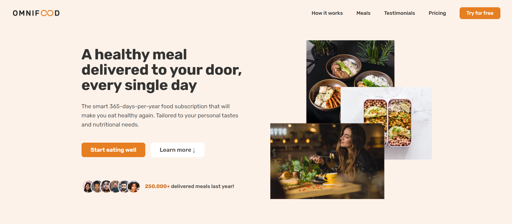

# Landing page for a food subscription service

[Omnifood live demo](https://omnifood-mker.netlify.app/)

Omnifood landing page

## Built with

- Semantic HTML5 markup
- Flexbox
- CSS Grid
- A bit of JS for nav and scrolling, Intersection Observer API

## Credits

This landing page was built as part of [Build Responsive websites course](https://www.udemy.com/course/design-and-develop-a-killer-website-with-html5-and-css3/)
